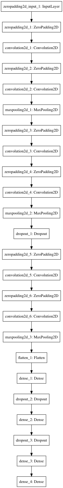
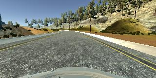
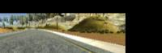
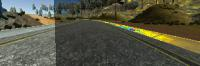
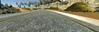
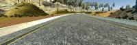

# **Behavioral Cloning**

The goals / steps of this project are the following:
* Use the simulator to collect data of good driving behavior
* Build, a convolution neural network in Keras that predicts steering angles from images taken by the vehicle in the simulator.
* Train and validate the model with a training and validation set.
* Test that the model successfully drives around track one without leaving the road.


## Rubric Points
##### Here we will briefly consider the [rubric points](https://review.udacity.com/#!/rubrics/432/view) individually and describe how each point is addressed in my implementation my implementation.  


## Model Architecture Design
This network uses a modified of the original CNN mentioned in the referenced NVIDIA paper in our project description.

It uses ELU activation instead of ReLU which has been found to capture nonlinearities faster on average for most problems.

The model used an adam optimizer, so the learning rate was not tuned manually (model.py line 25).

It uses dropout to prevent overfitting.

By flipping exactly half of our training images we ensure that we will have a balanced distribution of left and right steering angles, even though our training data might be going in one direction along the track.

Here is a visualization of the network:



###### model visualization generated using graphviz through keras

###### you can find the code that generates each of the models I had experimented with in `networks.py` which defines multiple functions that return different neural network architectures.

## Data Preprocessing

I managed to get this to work using the provided data, but I had to perform a lot of image manipulation to get the car to generalize to the actual track well.

This network consumes a generator that performs some careful preprocessing of images in order to get more value out of using them for training our neural network.

We use a generator here so that keras can take advantage of not needing to keep more than one `batch_size` of images in memory so that we can train on much larger sets without fear of memory resources.


### Image Manipulations

For each image we train with we choose one of the three cameras mounted on the car for training.

Starting with our original image from a camera:



With this image we perform a couple of operations:

- crop the top 1/3 and the bottom 1/5 containing the car
    - 
- translate the image randomly
    - 
- add random shadows
    - 
- randomly augment the brightness.
    - 
- flip half of the images and angles
    - 

Here is the code for this generator:

###### the generator for the validation and testing data is similar but of course does no image manipulation

```python
    # grab a random training example
    row = data_points[np.random.randint(len(data_points))]

    # select a random camera image and set path to one of our 3 camera images
    camera_selection = np.random.randint(3)
    impath = row[camera_selection]  # set image path
    angle = float(row[3])           # read steering angle

    # ignore low angles
    min_ang_threshold = 0.4
    if abs(angle) < .1:
        # for every small angle, flip a coin to see if we train with it.
        rand = np.random.uniform()
        if rand > min_ang_threshold: continue

    # center cam
    if (camera_selection == 0):
        shift_ang = 0.

    # left cam
    if (camera_selection == 1):
        shift_ang = .30

    # right cam
    if (camera_selection == 2):
        shift_ang = -.30

    # read our image from the camera of choice
    # impath = os.path.normpath(os.getcwd() + "/data/" + impath).replace(" ", "")
    impath = os.path.normpath(impath).replace(" ", "")
    image = cv2.imread(impath)
    angle = angle + shift_ang

    # translate the image randomly to better simulate road conditions
    image, angle = trans_image(image, angle, 100)

    # add random shadow
    image = add_random_shadows(image)

    # augment brightness
    image = augment_brightness_camera_images(image)

    # do the actual image preprocessing and cropping
    image = preprocess_image(image)

    # flip half the images
    flip_prob = np.random.randint(2)
    if flip_prob > 0:
        image = cv2.flip(image, 1)
        angle = -angle

    # fill batch of data
    batch_images[batch_filled] = image
    batch_steering[batch_filled] = angle
    batch_filled += 1
yield batch_images, batch_steering
```


## Model Training

The model was trained using cross validation along with a separated testing set used at the end.

The metric used for measuring loss was mean squared error.  On my more successful models this fluctuated around `0.03`.

The provided dataset was split; 80% of the data was used for training, the remaining 20% was used for validation, with 10% of the validation set being set aside for the testing set.


## Hyperparameter Tuning

I've read a few articles online that mention to use lower batch sizes and that will generalize better with more epochs, I found this generally to be the case, having good performance with a `batch_size` of `64` and eventually having a working model with a `batch_size` of `128`.

I chose an aggressive dropout of `.25` at first hoping to see Nvidia's model work, and saw moderate success with that however I was only able to get the model working with a dropout of `0.5`.

Using lower learning rates has been much more useful in the long run and has helped both in troubleshooting and testing.

I've had the best mileage (heh) with using a `samples_per_epoch` that was high and a multiple of the `batch_size`

The performance of my models tends to plateau around `15` epochs and doesn't get much better beyond that, or so I thought at first. My first working solution was functional after `100` epochs of training.


## Requirements

- python 3
- keras
- tensorflow-gpu
- cuDNN
- python-opencv
- numpy


## Usage

To generate the model based on the training dataset simply run `python network.py`.

The `drive.py` file remains relatively unchanged from the provided one.

After `train_model` has been run; two files will be generated; `model.json` and `model.h5`.

Simply run the following command once these files have been created.

```shell
python drive.py model.json
```

## Notes

When running `train_model.py` it currently expects that it is in the same directory as the `data` folder that the non-beta simulator normally outputs.

The simulator will store different filepaths (full or relative) contingent on which operating system that you're running this on, for example on windows.
```
C:\Users\david\Desktop\sel_driving>
├───data
│   └───IMG
├───network.py
```

Depending on whether the data was recorded on windows or not, the paths will not read correctly when training.

Lines `116` and `117` contain the different `imread()` functions for the different path formats.


## Final Thoughts

It would seem that my own working solution may be guilty of overfitting the dataset; when running my model in autonomous mode on the second track, the model was unable to go past the first turn. I will certainly be coming back to this problem in the future when I have more time and can try better networks and more robust solutions.

This has been by far the most challenging assignment I've ever been given completely overshadowing any of my work in undergraduate computer science.

It is unintuitive to debug neural networks at first and it certainly is something I'm much better at now after countless attempts.

As a student there are a lot of gaps in understanding that are always filled when trying to build the concept yourself.

The slack forum with the other students is incredibly helpful and I would not have been able to complete this assignment without the valuable contributions from the other students and the mentors online.

If this documentation is lacking please feel free to suggest any changes and thank you for reading.
